# jd-laptop: 京东笔记本数据爬取与分析👾


**Photo by Lauren Mancke on Unsplash*

## 目录
- [前言](#前言)
- [爬取过程](#爬取过程)
- [食用方法](#食用方法)
- [数据分析](#数据分析)
	- [词云图](#词云图)
	- [好评/差评率最高的 20 件](#好评差评率最高的-20-件)
	- [价格最高/最低的 20 件](#价格最高最低的-20-件)
	- [价格 1w 以上销量最高的 20 件](#价格-1w-以上销量最高的-20-件)
	- [价格 7k-1w 销量最高的 20 件](#价格-7k-1w-销量最高的-20-件)
	- [价格 5k-7k 销量最高的 20 件](#价格-5k-7k-销量最高的-20-件)
	- [价格 5k 以下销量最高的 20 件](#价格-5k-以下销量最高的-20-件)
	- [苹果销量最高的 20 件](#苹果销量最高的-20-件)
	- [小米销量最高的 20 件](#小米销量最高的-20-件)
	- [华为销量最高的 20 件](#华为销量最高的-20-件)
	- [联想销量最高的 20 件](#联想销量最高的-20-件)
	- [戴尔销量最高的 20 件](#戴尔销量最高的-20-件)
	- [华硕销量最高的 20 件](#华硕销量最高的-20-件)
	- [惠普销量最高的 20 件](#惠普销量最高的-20-件)
	- [宏基销量最高的 20 件](#宏基销量最高的-20-件)
	- [微软销量最高的 20 件](#微软销量最高的-20-件)
	- [神舟销量最高的 20 件](#神舟销量最高的-20-件)
	- [机械革命销量最高的 20 件](#机械革命销量最高的-20-件)
	- [雷神销量最高的 20 件](#雷神销量最高的-20-件)
	- [销量前 1k 分布](#销量前-1k-分布)
	- [好评率前 1k 分布](#好评率前-1k-分布)

## 前言

与之前 [RAM-JD](https://github.com/LewisTian/RAM-JD) 项目类似，最近也想换笔记本了，所以来京东做个调研，康康笔记本的情况（虽然已经有了想买的那一款），但是多比较看看总不会有错。

也是第一次使用 [Scrapy](https://scrapy.org/) 来爬取数据，之前或者说一直都是使用 [requests](https://github.com/kennethreitz/requests)，也可能是一段 Scrapy 从入门到入土的历程吧（笑

## 爬取过程

1. 新建 Scrapy 项目，并新建一个爬虫（按教程来的

```bash
>> scrapy startproject jd_laptop
>> cd jd_laptop
>> scrapy genspider laptop jd.com
```

2. 编写爬虫代码

京东页面也在不断变化以应对各种各样的爬虫（滑稽），现在请求页面只能拿到商品名称和链接/id，对应的价格、店铺和评价等等都是异步加载的。

找到对应异步链接之后就可以开始爬取数据了，一共三个分别是评论数、店铺名称和价格。分别针对这三类请求写三个回调函数就行了。

然后有个问题是在 Scrapy 中请求是异步的，所以导致在保存数据有点麻烦。一个简单的想法是使用信号，当爬虫结束的时统一保存所有数据，虽然有点蠢，却是没有办法情况下的办法了。

3. 爬取结果

数据在 [data/data.7z](jd_laptop/data/data.7z)，一共拿到 58824 条数据（除去表头）。

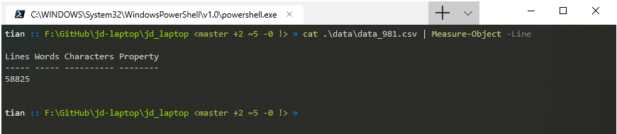

## 食用方法

默认保存为 csv，若是想保存为 json，需要将 spiders/laptop.py 中的 SAVE_DATA_TYPE 变量改为 0。

```bash
>> git clone https://github.com/LewisTian/jd-laptop.git
>> cd jd-laptop
>> pip install -r requirements.txt
>> cd jd_laptop
>> scrapy crawl laptop
```

若要导入 MySQL，先创建表 laptop，建表语句可以参考 [data/db.sql](jd_laptop/data/db.sql)

然后就是导入数据:

```bash
load data infile 'F:/GitHub/jd-laptop/jd_laptop/data/data_981.csv' into table laptop fields terminated by ',' optionally enclosed by '"' escaped by '"' lines terminated by '\r\n'
```

## 数据分析

商品可以通过 https://item.jd.com/{product_id}.html 访问。

### 词云图

|   笔记本名称     |   店铺    |
|  -------------  | -------   |
|  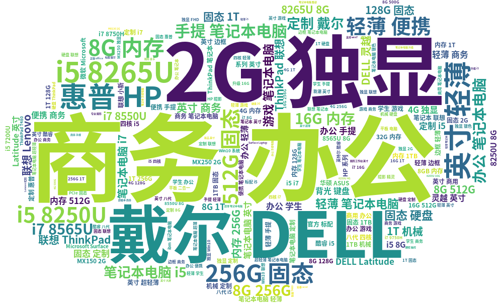   | 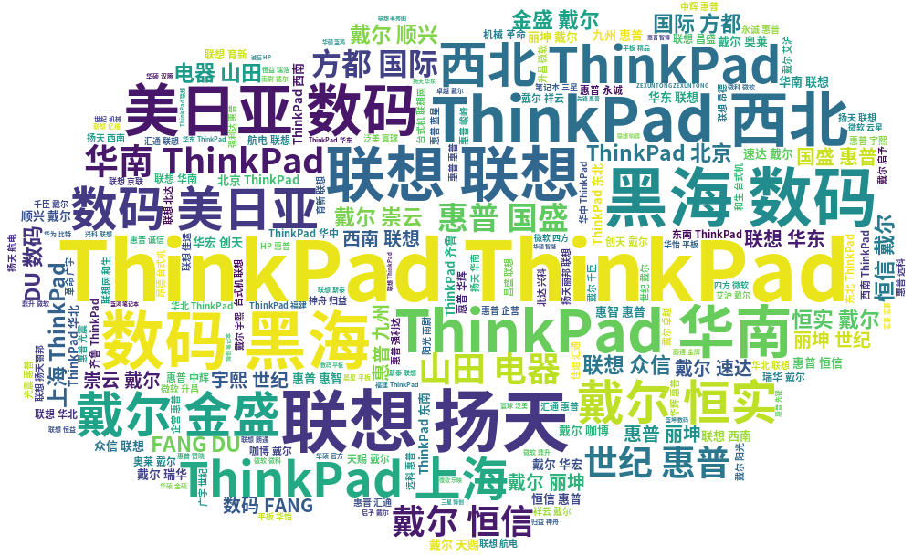 |

### 好评/差评率最高的 20 件

美帝良心想🐮🍺

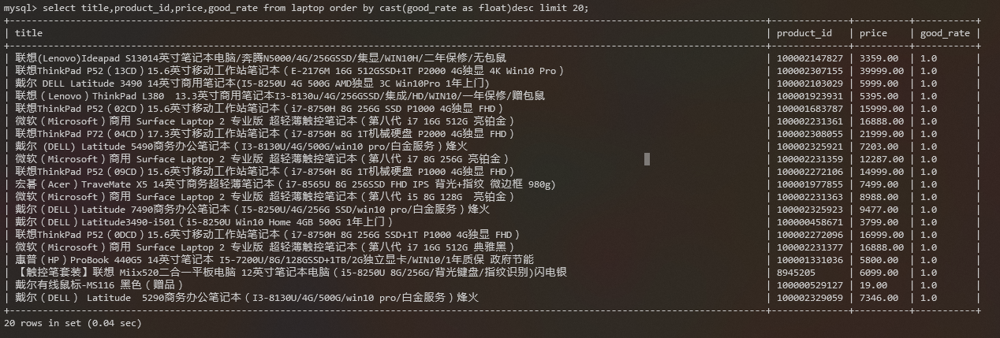

<p></p>

不明觉厉，差评 100% 还行

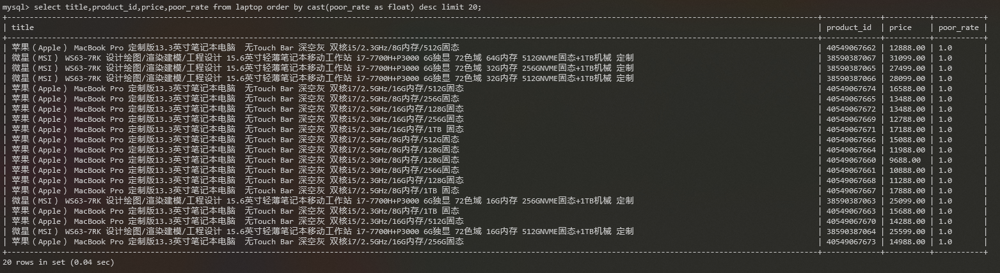

### 价格最高/最低的 20 件

🐮🍺不愧是美帝良心想


<p></p>

有些下架了就显示价格为 -1，因此将价格转化为无符号数了。

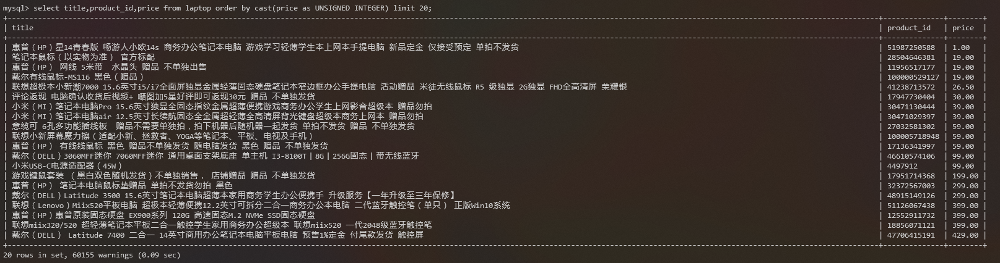

### 销量最高的 50 件

由于京东爬不到销售量，所以暂且拿评论数当作销售量的反映吧。

本来是前十的，结果发现都是荣耀 MagicBook，于是扩大到 50，结果后面又都是小米😂

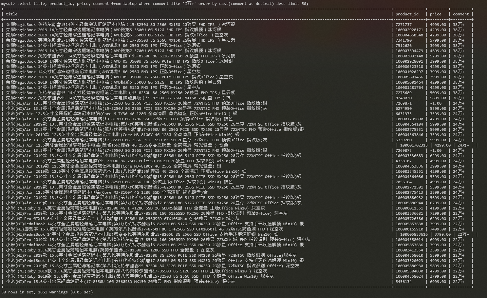

### 价格 1w 以上销量最高的 20 件

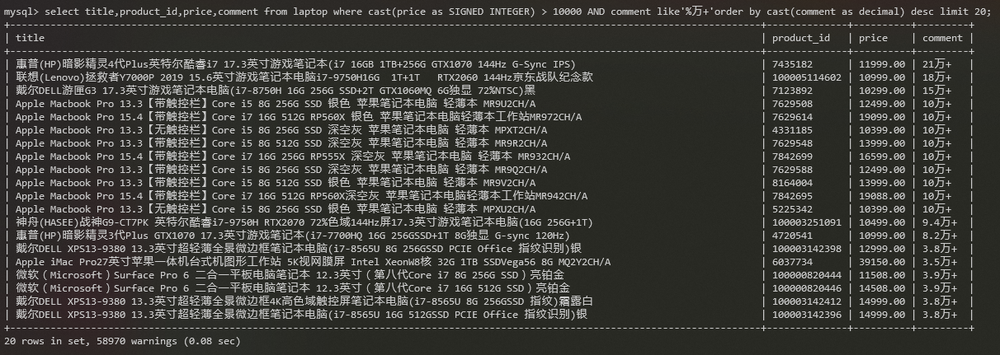

### 价格 7k-1w 销量最高的 20 件


### 价格 5k-7k 销量最高的 20 件

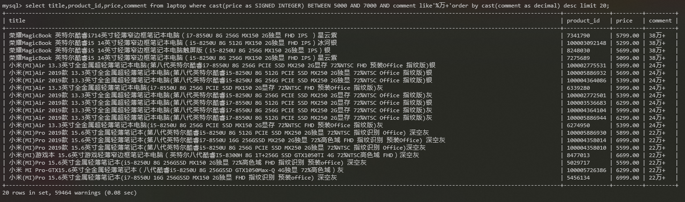

### 价格 5k 以下销量最高的 20 件

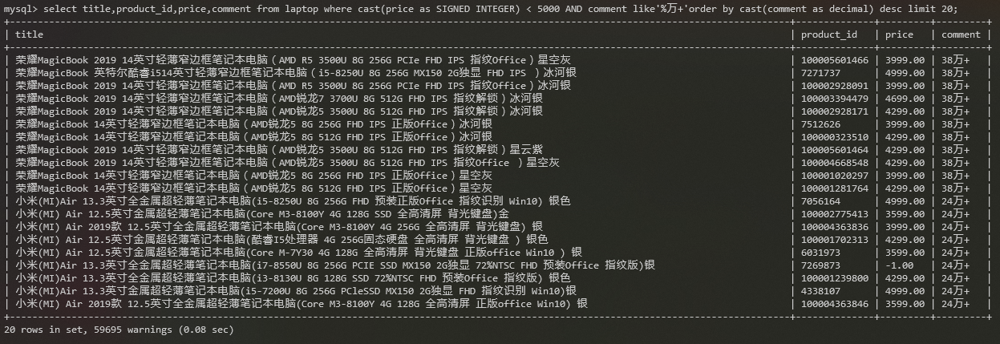

### 苹果销量最高的 20 件

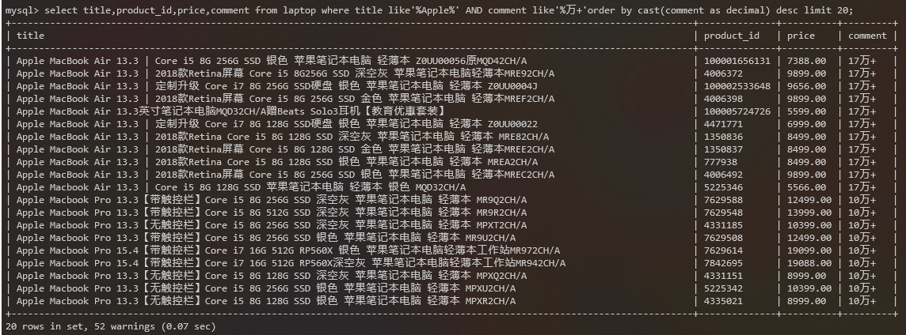

### 小米销量最高的 20 件

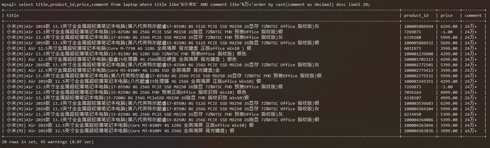

### 华为销量最高的 20 件

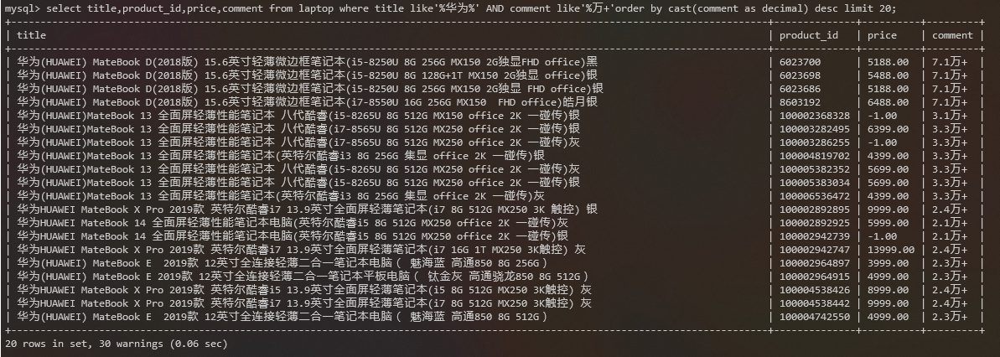

### 荣耀销量最高的 20 件

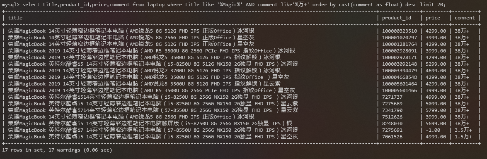

### 联想销量最高的 20 件

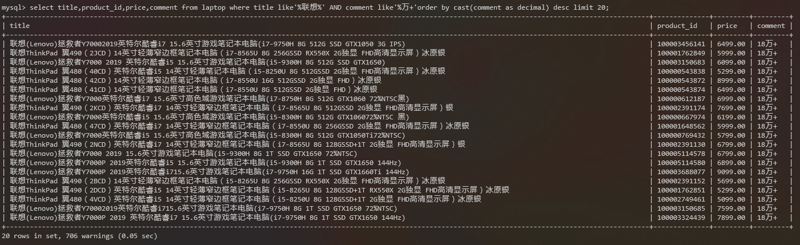

### 戴尔销量最高的 20 件

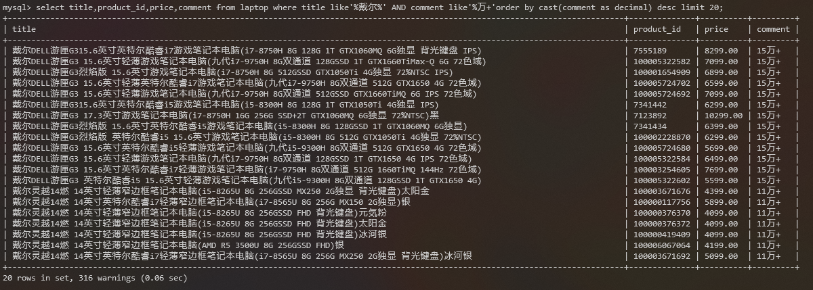

### 华硕销量最高的 20 件

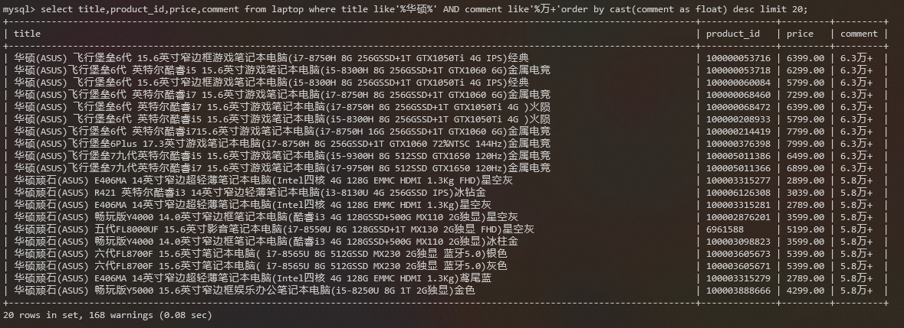

### 惠普销量最高的 20 件

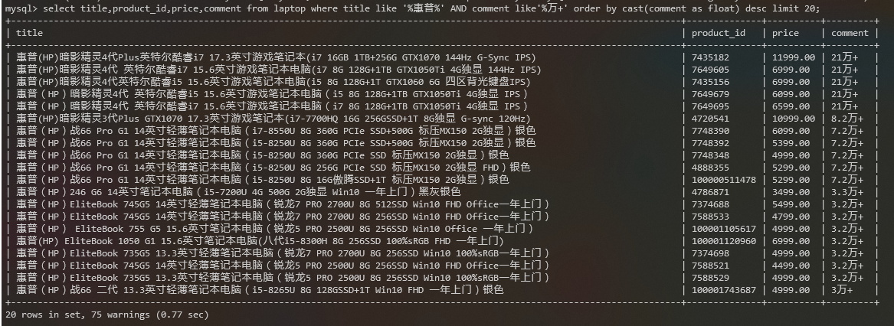

### 宏基销量最高的 20 件

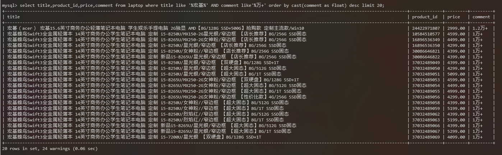

### 微软销量最高的 20 件

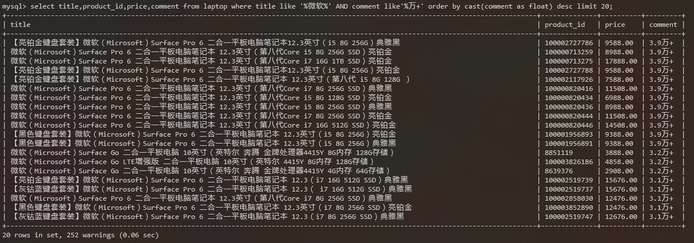

### 神舟销量最高的 20 件

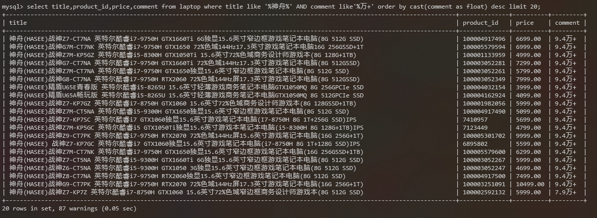

### 机械革命销量最高的 20 件

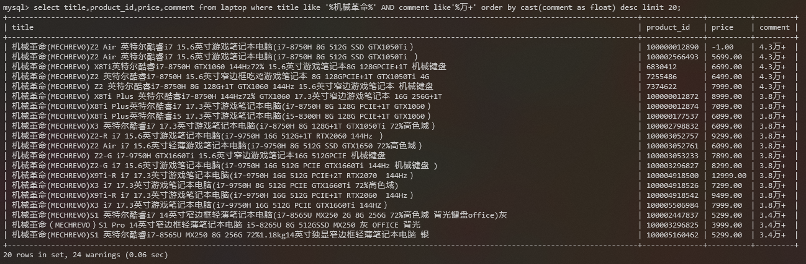

### 雷神销量最高的 20 件

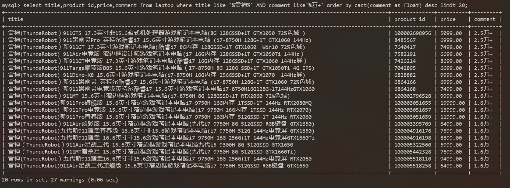

### 销量前 1k 分布

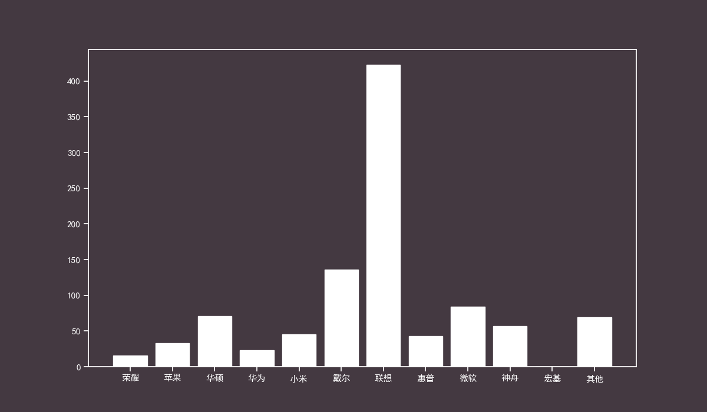

### 好评率前 1k 分布

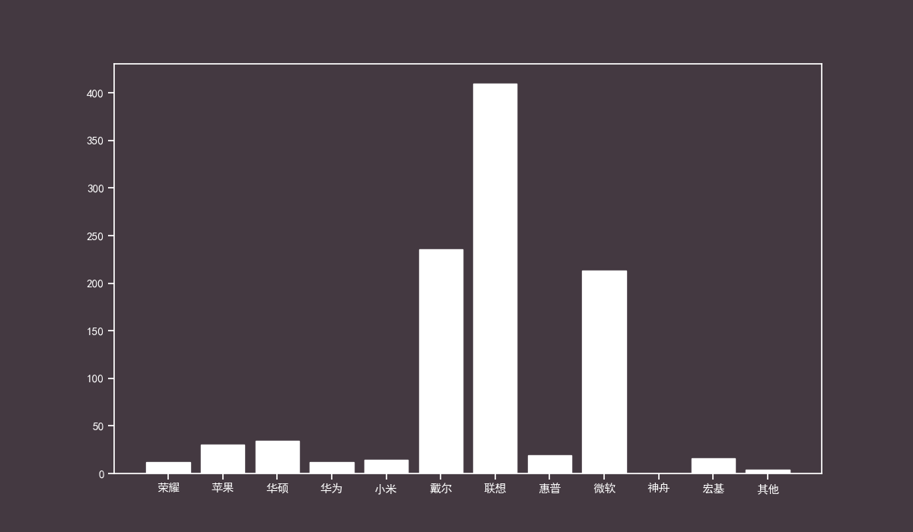

## LICENSE

Copyright (c) 2019 Lewis Tian. Licensed under the MIT license.